# LearnSphere - Level 0 Data Flow Diagram (Context Diagram)

This diagram provides a high-level overview of the LearnSphere platform. It illustrates the entire system as a single process and shows the key data flows between the platform and its external entities.

```mermaid
graph TD
    subgraph External Entities
        UnauthenticatedUser[Unauthenticated User]
        Student[Student]
        Tutor[Tutor]
        ShopOwner[Shop Owner]
        Admin[Admin]
        Stripe[Stripe Payment Gateway]
        GoogleMaps[Google Maps API]
        GoogleAI[Google AI/Genkit]
    end

    subgraph System
        A(LearnSphere Platform)
    end

    %% Unauthenticated User Flows
    UnauthenticatedUser -- "Signup & Login Credentials" --> A
    A -- "Public Pages (Tutors, Books), Auth Forms" --> UnauthenticatedUser

    %% Student Flows
    Student -- "Profile Updates, Search/Filter Criteria" --> A
    Student -- "Booking Requests, Add to Cart/Wishlist" --> A
    Student -- "Checkout & Shipping Info" --> A
    Student -- "AI Chat Prompts & Quiz Requests" --> A
    A -- "Dashboard, Tutor Profiles, Book Details" --> Student
    A -- "Booking/Order Status, Cart/Wishlist Data" --> Student
    A -- "AI Responses & Quiz Results" --> Student

    %% Tutor Flows
    Tutor -- "Tutor Application, Profile & Slot Updates" --> A
    Tutor -- "Booking Confirmations/Rejections" --> A
    A -- "Dashboard, Booking Requests, Student Info" --> Tutor

    %% Shop Owner Flows
    ShopOwner -- "Shop Registration Details" --> A
    ShopOwner -- "Create/Update Book Listings & Images" --> A
    A -- "Seller Dashboard, Order Notifications" --> ShopOwner

    %% Admin Flows
    Admin -- "User/Book/Application Management Actions" --> A
    A -- "Admin Dashboard, All User/Booking/Order Data" --> Admin

    %% Stripe Flows
    A -- "Payment Request (Checkout Session)" --> Stripe
    Stripe -- "Payment Confirmation/Failure" --> A

    %% Google Maps Flows
    A -- "Address Search, Geocoding Request" --> GoogleMaps
    GoogleMaps -- "Map Data, Location Coordinates" --> A

    %% Google AI Flows
    A -- "Generate Quiz/Chat Request" --> GoogleAI
    GoogleAI -- "AI-Generated Content (Text, JSON)" --> A
```

## Diagram Legend

### External Entities

*   **Unauthenticated User**: A visitor who has not logged in.
*   **Student**: A logged-in user who books tutors and buys books.
*   **Tutor**: A verified user who offers tutoring services.
*   **Shop Owner**: A verified user who sells books on the marketplace.
*   **Admin**: A privileged user who manages the platform.
*   **Stripe**: The external service for processing credit card payments.
*   **Google Maps API**: The external service for location search and map rendering.
*   **Google AI/Genkit**: The service used for generative AI features like the study buddy and quiz generator.

### Central Process

*   **LearnSphere Platform**: Represents the entire web application, including its frontend, backend logic, and database interactions (Firebase).
